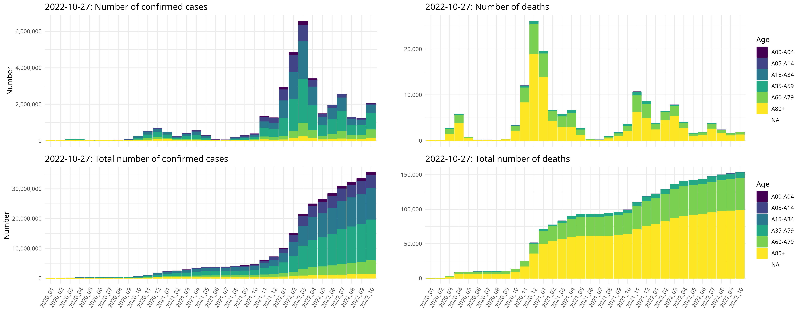

<!-- Rmd -> md --> 

```{r, echo=FALSE, message=FALSE}
library(magrittr)
library(covid19germany)

rki <- get_RKI_timeseries(cache = F) 

p1 <- rki %>% plot_RKI_timeseries("Age", "NumberNewTestedIll", label = F)
p2 <- rki %>% plot_RKI_timeseries("Age", "CumNumberTestedIll")
p3 <- rki %>% plot_RKI_timeseries("Age", "NumberNewDead", label = F)
p4 <- rki %>% plot_RKI_timeseries("Age", "CumNumberDead")

p <- cowplot::plot_grid(p1, p2, p3, p4, nrow = 2, ncol = 2)

cowplot::ggsave2("man/figures/README_plot.png", device = "png", p, width = 10, height = 3, scale = 1.5)
```



[](https://travis-ci.com/nevrome/covid19germany) [](https://codecov.io/github/nevrome/covid19germany?branch=master)

# covid19germany

An R package to load, visualise and analyse daily updated data on the COVID-19 outbreak in Germany. This package exists to simplify data analysis and was developed in the context of the [#WirvsVirus hackathon](https://www.bundesregierung.de/breg-de/themen/coronavirus/wir-vs-virus-1731968). A minimal webapp to explore the data is available [here](https://nevrome.shinyapps.io/covid19germany/).

<p align="center">
  
</p>

- [**Install**](#Install)
- [**Functions and data**](#functions-and-data)
    - [RKI timeseries](#rki-timeseries)
    - [RKI spatial](#rki-spatial)
    - [Population numbers](#population-numbers)
    - [Hospital beds](#hospital-beds) 

## Install 

Install the development version from github with

```
if(!require('remotes')) install.packages('remotes')
remotes::install_github("nevrome/covid19germany")
```

## Functions and data

### RKI timeseries

```
covid19germany::get_RKI_timeseries()
```

[Daily updated RKI data about COVID-19 cases and deaths for germany (timeseries)](https://npgeo-corona-npgeo-de.hub.arcgis.com/datasets/dd4580c810204019a7b8eb3e0b329dd6_0). Provided by the Bundesamt für Kartographie und Geodäsie as well as the Robert Koch Institut. 

Data format: tibble/data.frame with one row per spatial unit ("Landkreis"), date and age group, with daily notifications of cases ("NumberNewTestedIll") and deaths ("NumberNewDead").

| ObjectId|Date       | IdBundesland|Bundesland    | IdLandkreis|Landkreis |Age     |Gender | NumberNewTestedIll| NumberNewDead|
|--------:|:----------|------------:|:-------------|-----------:|:---------|:-------|:------|------------------:|-------------:|
|   404635|2020-03-19 |            3|Niedersachsen |        3157|LK Peine  |A35-A59 |M      |                  2|             0|
|   404636|2020-03-20 |            3|Niedersachsen |        3157|LK Peine  |A35-A59 |M      |                  1|             0|
|   404637|2020-03-21 |            3|Niedersachsen |        3157|LK Peine  |A35-A59 |M      |                  2|             0|

You can convert this RKI data to daily timeseries for federal states (Bundesland), administrative districts (Landkreis), gender (Gender) and/or age (Age). It's possible to group by muliple of these at once.

```
covid19germany::group_RKI_timeseries(data, "Bundesland" | "Landkreis" | "Gender" | "Age")
```

Data format: tibble/data.frame with a time series of cases, deaths, cumulative cases and cumulative deaths. One row per day and grouping unit. Days are continuous, without gaps. All time series start at 2020-01-28, and go up to the current date (last update by RKI). `covid19germany::group_RKI_timeseries(data, "Bundesland")`:

|Bundesland        |Date       | NumberNewTestedIll| NumberNewDead| CumNumberTestedIll| CumNumberDead| IdBundesland|
|:-----------------|:----------|------------------:|-------------:|------------------:|-------------:|------------:|
|Baden-Württemberg |2020-01-24 |                  1|             0|                  1|             0|            8|
|Baden-Württemberg |2020-01-25 |                  0|             0|                  1|             0|            8|
|Baden-Württemberg |2020-01-26 |                  0|             0|                  1|             0|            8|

### RKI spatial

```
covid19germany::get_RKI_spatial("Bundesland" | "Landkreis")
```

[Daily updated RKI data about COVID-19 cases and deaths for germany (spatial)](https://npgeo-corona-npgeo-de.hub.arcgis.com/search?groupIds=b28109b18022405bb965c602b13e1bbc). Provided by the Bundesamt für Kartographie und Geodäsie as well as the Robert Koch Institut. 

Data format: sf object with columns for cases and deaths as well as geometry information for the spatial units. One row per Bundesland or per Landkreis. This table only contains information for one day. It can also be used to plot past data when combined with the timeseries dataset.

### Population numbers

```
covid19germany::ew_laender
covid19germany::ew_kreise
covid19germany::ew_alter
```

[Population numbers for the german Länder](https://www.statistikportal.de/de/bevoelkerung/flaeche-und-bevoelkerung) and [Kreise](https://www.destatis.de/DE/Themen/Laender-Regionen/Regionales/Gemeindeverzeichnis/Administrativ/04-kreise.html) on 2018-12-31. Provided by the Statistisches Bundesamt. (Population data for administrative units of Berlin in dataset ew_laender is missing.)

Data format: tibble/data.frame with information about population and area size of Länder and Kreise. One row per Land/Landkreis/Age.

|Bundesland         |  AreaKm2| PopulationTotal| PopulationMale| PopulationFemale| PopulationperKm2|
|:------------------|--------:|---------------:|--------------:|----------------:|----------------:|
|Schleswig-Holstein | 15804.30|         2896712|        1419457|          1477255|              183|
|Hamburg            |   755.09|         1841179|         902048|           939131|             2438|
|Niedersachsen      | 47709.51|         7982448|        3943243|          4039205|              167|

| IdLandkreis|NameLandkreis          |NUTS3 | AreaKm2| PopulationTotal| PopulationMale| PopulationFemale| PopulationperKm2|
|-----------:|:----------------------|:-----|-------:|---------------:|--------------:|----------------:|----------------:|
|        1001|Flensburg, Stadt       |DEF01 |   56.73|           89504|          44599|            44905|             1578|
|        1002|Kiel, Landeshauptstadt |DEF02 |  118.65|          247548|         120566|           126982|             2086|
|        1003|Lübeck, Hansestadt     |DEF03 |  214.19|          217198|         104371|           112827|             1014|

|Age     | PopulationTotal| PopulationMale| PopulationFemale|
|:-------|---------------:|--------------:|----------------:|
|A00-A04 |         3926397|        2014097|          1912300|
|A05-A14 |         7364418|        3786605|          3577813|
|A15-A34 |        19213113|        9977728|          9235385|

### Hospital beds

```
covid19germany::hospital_beds
```

[Hospital beds and ICUs in Germany](http://www.gbe-bund.de/gbe10/f?f=328::Intensivstation) in 2017 with a last update from 2018-11-13. Provided by the Statistisches Bundesamt as well as the Robert Koch Institut.

Data format: tibble/data.frame with information about number, facilities and occupancy rate of hospitals and hospital beds in the german Länder. One row per Land.

|Bundesland        |NumberHospital | NumberHospitalwithICU| NumberICUBed| NumberDaysICUBedinUse| NumberICUCase| NumberICUCasewithRespirator|
|:-----------------|:--------------|---------------------:|------------:|---------------------:|-------------:|---------------------------:|
|Baden-Württemberg |265            |                   123|         3262|                900678|        259066|                       47528|
|Bayern            |354            |                   178|         3790|               1085912|        300728|                       62044|
|Berlin            |83             |                    35|         1450|                439183|         94480|                       22887|

