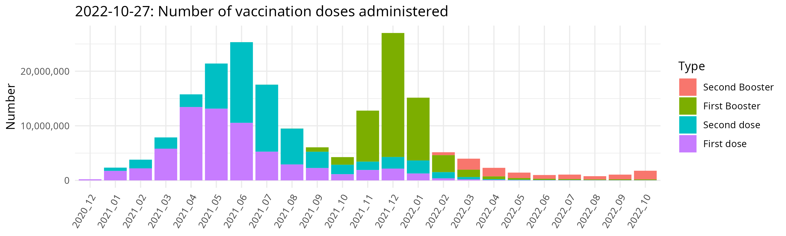

<!-- Rmd -> md --> 

```{r, echo=FALSE, message=FALSE}
library(magrittr)
library(covid19germany)
library(ggplot2)

rki <- get_RKI_timeseries(cache_dir = "cache")

p1 <- rki %>% plot_RKI_timeseries("Age", "NumberNewTestedIll", label = F) +
  theme(axis.text.x = element_blank(), axis.title.x = element_blank())
p2 <- rki %>% plot_RKI_timeseries("Age", "NumberNewDead") +
  theme(axis.text.x = element_blank(), axis.title.x = element_blank(),
        axis.title.y = element_blank())
p4 <- rki %>% plot_RKI_timeseries("Age", "CumNumberTestedIll", label = F) +
  xlab("Calender week")
p5 <- rki %>% plot_RKI_timeseries("Age", "CumNumberDead") +
  xlab("Calender week") +
  theme(axis.title.y = element_blank())

p <- cowplot::plot_grid(p1, p2, p4, p5,
  nrow = 2, ncol = 2, 
  rel_widths = c(0.9,1),
  rel_heights = c(0.9,1), align = "v", axis = 'l'
)

cowplot::ggsave2("man/figures/README_plot.png", device = "png", p, width = 10, height = 4, scale = 1.7)
```


```{r, echo=FALSE, message=FALSE}
library(magrittr)
library(ggplot2)

vac_ts <- covid19germany::get_RKI_vaccination_timeseries()

p_vac <- vac_ts %>%
  dplyr::transmute(
    Date,
    CumNumberFullyVaccinated = cumsum(NumberFullyVaccinated),
    CumNumberVaccinatedOnlyOnce = cumsum(NumberVaccinatedOnce) - CumNumberFullyVaccinated
  ) %>%
  tidyr::pivot_longer(
    cols = c("CumNumberVaccinatedOnlyOnce", "CumNumberFullyVaccinated"),
    names_to = "Type",
    values_to = "Number"
  ) %>%
  dplyr::mutate(
    Type = dplyr::recode(
      Type,
      "CumNumberVaccinatedOnlyOnce" = "First dose",
      "CumNumberFullyVaccinated" = "Fully vaccinated"
    )
  ) %>%
  ggplot() +
  geom_bar(aes(x = Date, y = Number, fill = Type), stat = "identity") +
  scale_y_continuous(labels = scales::comma) +
  ggtitle(paste0(lubridate::today(), ": Total number of vaccination doses administered")) +
  theme_minimal() +
  theme(axis.title.x = element_blank())

ggplot2::ggsave("man/figures/README_plot_vac.png", device = "png", p_vac, width = 10, height = 2.7, scale = 0.8)
```



[](https://travis-ci.com/nevrome/covid19germany) [](https://codecov.io/github/nevrome/covid19germany?branch=master)

# covid19germany

An R package to load, visualise and analyse daily updated data on the COVID-19 outbreak in Germany. This package exists to simplify data analysis and was developed in the context of the [#WirvsVirus hackathon](https://www.bundesregierung.de/breg-de/themen/coronavirus/wir-vs-virus-1731968). A minimal webapp to explore the data is available [here](https://nevrome.shinyapps.io/covid19germany/).

<p align="center">
  
</p>

- [**Install**](#Install)
- [**Functions and data**](#functions-and-data)
    - [RKI vaccination progress](#rki-vaccination-progress)
    - [RKI timeseries](#rki-timeseries)
    - [RKI spatial](#rki-spatial)
    - [Population numbers](#population-numbers)
    - [Hospital beds](#hospital-beds) 

## Install 

Install the development version from github with

```
if(!require('remotes')) install.packages('remotes')
remotes::install_github("nevrome/covid19germany")
```

## Functions and data

### RKI vaccination progress

[Daily updated RKI data about COVID-19 vaccinations in germany](https://www.rki.de/DE/Content/InfAZ/N/Neuartiges_Coronavirus/Daten/Impfquoten-Tab.html). Provided by the Robert Koch Institut.

```
rki_vaccinations_timeseries <- covid19germany::get_RKI_vaccination_timeseries()
```

### RKI timeseries

```
rki <- covid19germany::get_RKI_timeseries()
```

[Daily updated RKI data about COVID-19 cases and deaths for germany (timeseries)](https://npgeo-corona-npgeo-de.hub.arcgis.com/datasets/dd4580c810204019a7b8eb3e0b329dd6_0). Provided by the Bundesamt für Kartographie und Geodäsie as well as the Robert Koch Institut. 

You can convert this RKI data to daily timeseries for federal states (Bundesland), administrative districts (Landkreis), gender (Gender) and/or age (Age). 

```
covid19germany::group_RKI_timeseries(rki, Bundesland)
covid19germany::group_RKI_timeseries(rki, Landkreis)
covid19germany::group_RKI_timeseries(rki, Gender)
covid19germany::group_RKI_timeseries(rki, Age)
```

It's possible to group by multiple of these at once, e.g.

```
covid19germany::group_RKI_timeseries(rki, Bundesland, Age)
```

### RKI spatial

```
covid19germany::get_RKI_spatial("Bundesland")
covid19germany::get_RKI_spatial("Landkreis")
```

[Daily updated RKI data about COVID-19 cases and deaths for germany (spatial)](https://npgeo-corona-npgeo-de.hub.arcgis.com/search?groupIds=b28109b18022405bb965c602b13e1bbc). Provided by the Bundesamt für Kartographie und Geodäsie as well as the Robert Koch Institut. 

### Population numbers

```
covid19germany::ew_laender
covid19germany::ew_kreise
covid19germany::ew_alter
```

[Population numbers for the german Länder](https://www.statistikportal.de/de/bevoelkerung/flaeche-und-bevoelkerung) and [Kreise](https://www.destatis.de/DE/Themen/Laender-Regionen/Regionales/Gemeindeverzeichnis/Administrativ/04-kreise.html) on 2018-12-31. Provided by the Statistisches Bundesamt. (Population data for administrative units of Berlin in dataset ew_laender is missing.)

### Hospital beds

```
covid19germany::hospital_beds
```

[Hospital beds and ICUs in Germany](http://www.gbe-bund.de/gbe10/f?f=328::Intensivstation) in 2017 with a last update from 2018-11-13. Provided by the Statistisches Bundesamt as well as the Robert Koch Institut.
