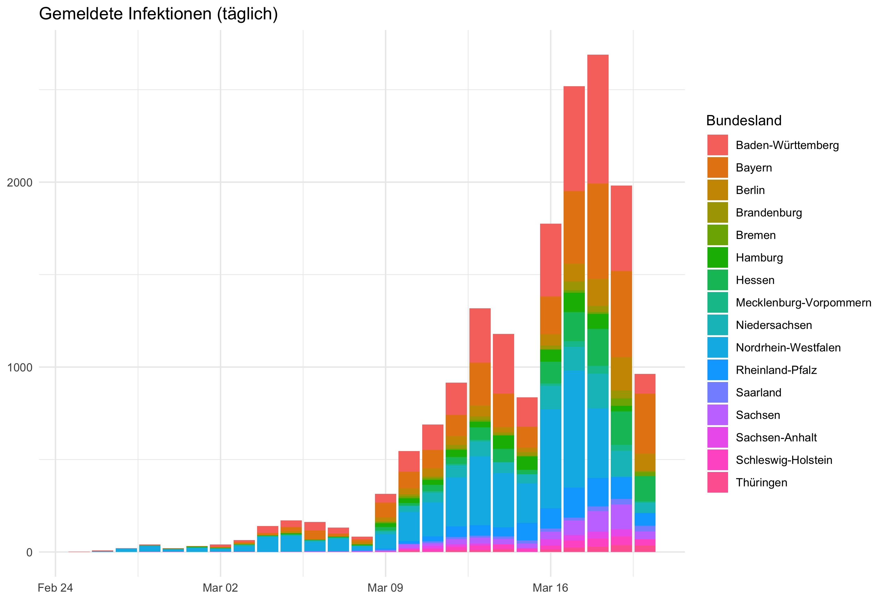

# covid19germany

R Package to download data related to the COVID-19 outbreak in Germany directly into R. This package exists to simplify data analysis.

Developed in the context of the [#WirvsVirus hackathon](https://www.bundesregierung.de/breg-de/themen/coronavirus/wir-vs-virus-1731968).

## Install 

Install the development version from github with

```
if(!require('devtools')) install.packages('devtools')
devtools::install_github("nevrome/covid19germany")
```
## Functions

### Download [RKI data for germany (timeseries)](https://npgeo-corona-npgeo-de.hub.arcgis.com/datasets/dd4580c810204019a7b8eb3e0b329dd6_0):

```
covid19germany::get_RKI_timeseries()
```

Data format: One row per spatial unit ("Landkreis"), date and age group, with daily notifications of cases ("AnzahlFall") and deaths ("AnzahlTodesfall").

|IdBundesland|Bundesland|Landkreis|Altersgruppe|Geschlecht|AnzahlFall|AnzahlTodesfall|ObjectId|Meldedatum|IdLandkreis|
|--|--------------|------------|-------|-|-|-|------|----------|-----|
|15|Sachsen-Anhalt|SK Magdeburg|A35-A59|M|2|0|154936|2020-03-18|15003|
|15|Sachsen-Anhalt|SK Magdeburg|A35-A59|W|1|0|154937|2020-03-12|15003|
|15|Sachsen-Anhalt|SK Magdeburg|A35-A59|W|1|0|154938|2020-03-17|15003|

### Convert downloaded RKI data to daily timeseries for federal states (Bundesland), administrative districts (Landkreis), gender (Geschlecht) or age (Altersgruppe):

```
covid19germany::group_RKI_timeseries(data, ("Bundesland" | "Landkreis" | "Geschlecht" | "Altersgruppe"))
```

Data format: Time series of cases, deaths, cumulative cases and cumulative deaths, with one row per day. Days are continuous, without gaps. All time series start at 2020-01-28, and go up to the current date (last update by RKI)

|Bundesland|Meldedatum|AnzahlFall|AnzahlTodesfall|KumAnzahlFall|KumAnzahlTodesfall|
|------|----------|-|-|-|-|
|Bayern|2020-01-28|2|0|2|0|
|Bayern|2020-01-29|2|0|4|0|
|Bayern|2020-01-30|0|0|4|0|
|Bayern|2020-01-31|3|0|7|0|
|Bayern|2020-02-01|0|0|7|0|
|Bayern|2020-02-02|0|0|7|0|
|Bayern|2020-02-03|1|0|8|0|
|Bayern|2020-02-04|2|0|10|0|
|Bayern|2020-02-05|0|0|10|0|
|Bayern|2020-02-06|1|0|11|0|

## Examples

### Reading data, joining population data

```r
# Get RKI data and transform to daily time series, e.g. per "Bundesland"
data <- covid19germany::get_RKI_timeseries()
time_series <- covid19germany::group_RKI_timeseries(data, "Bundesland")

# Extract one "Bundesland" and plot cumulative cases
bayern <- time_series[time_series$Bundesland == "Bayern",]
plot(bayern$Meldedatum, bayern$KumAnzahlFall, type="l")

# Join population to RKI table
# Population data for "Landkreise" is available as "ew_kreise"
time_series <- time_series %>%
  left_join(ew_laender, by="Bundesland")

# Calculate cases per 100k inhabitants
time_series$KumFaelle100kEW <- 100000 * time_series$KumAnzahlFall / time_series$EwGesamt
  
```

### Example plots

```r
library(ggplot2)
library(magrittr)

dat <- get_RKI_timeseries(cache=F)

group_RKI_timeseries(dat, Bundesland) %>%
  dplyr::filter(Meldedatum > "2020-02-25") %>%
  tidyr::drop_na(Bundesland) %>%
  ggplot() +
  geom_bar(mapping = aes(x = Meldedatum,
                         y = AnzahlFall,
                         fill = Bundesland),
           stat = 'identity') +
  theme_minimal() +
  ggtitle("Gemeldete Infektionen (täglich)") +
  theme(axis.title.x=element_blank(),
        axis.title.y=element_blank())
```

results in this plot:




```r
library(ggplot2)
library(magrittr)

dat <- get_RKI_timeseries(cache=F)

group_RKI_timeseries(dat, Bundesland) %>%
  dplyr::filter(Meldedatum > "2020-02-25") %>%
  tidyr::drop_na(Bundesland) %>%
  dplyr::group_by(Bundesland) %>%
  dplyr::mutate(kum_fall = cumsum(AnzahlFall)) %>%
  dplyr::ungroup() %>%
  ggplot() +
  geom_area(mapping = aes(x = Meldedatum,
                          y = kum_fall,
                          fill = Bundesland),
            stat = 'identity',
            na.rm = T) +
  theme_minimal() +
  ggtitle("Gemeldete Infektionen (kumulativ)") +
  theme(axis.title.x=element_blank(),
        axis.title.y=element_blank())
```

results in this plot:


