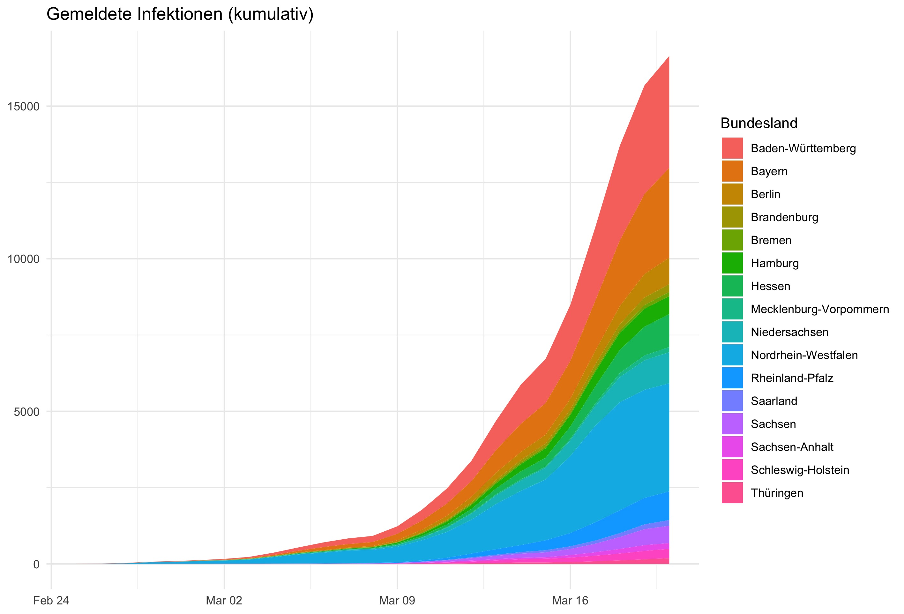
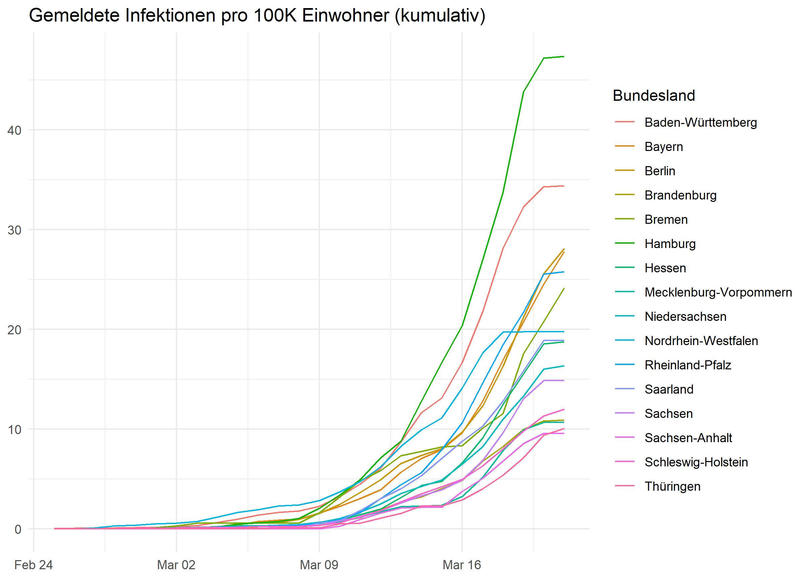
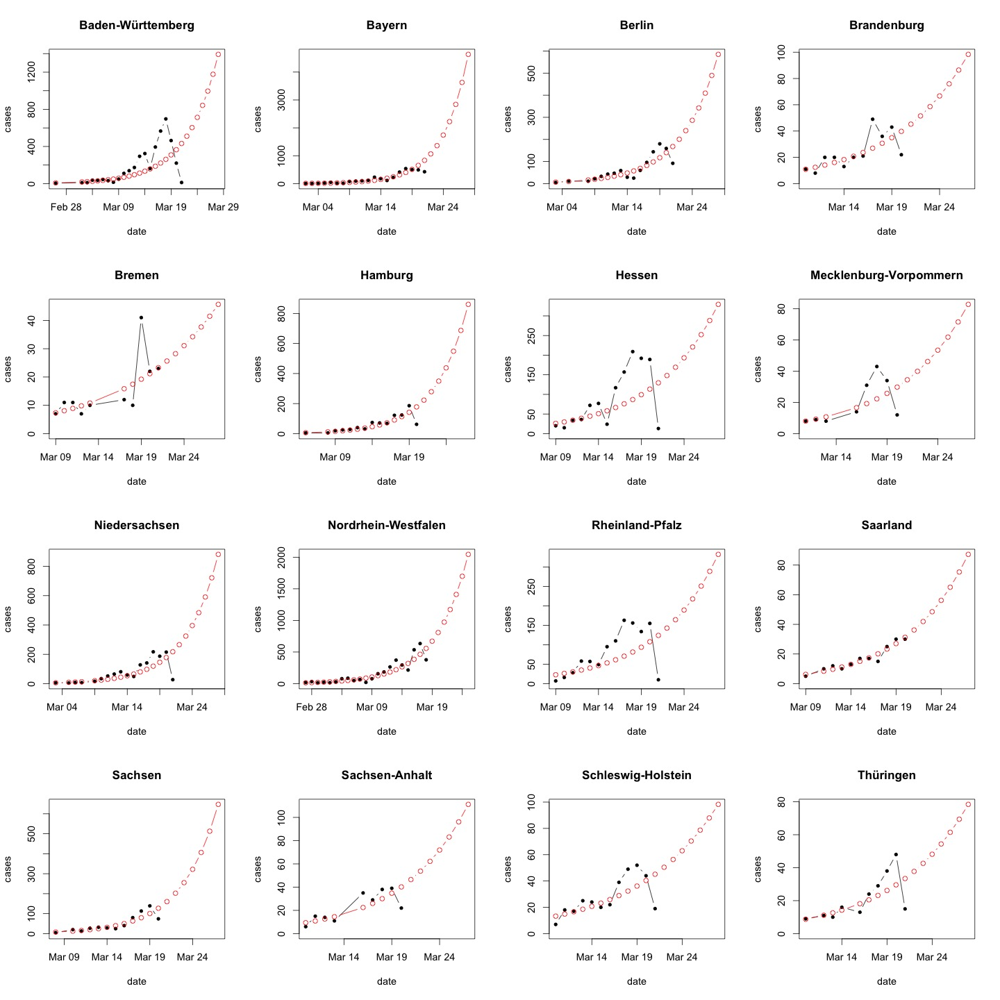
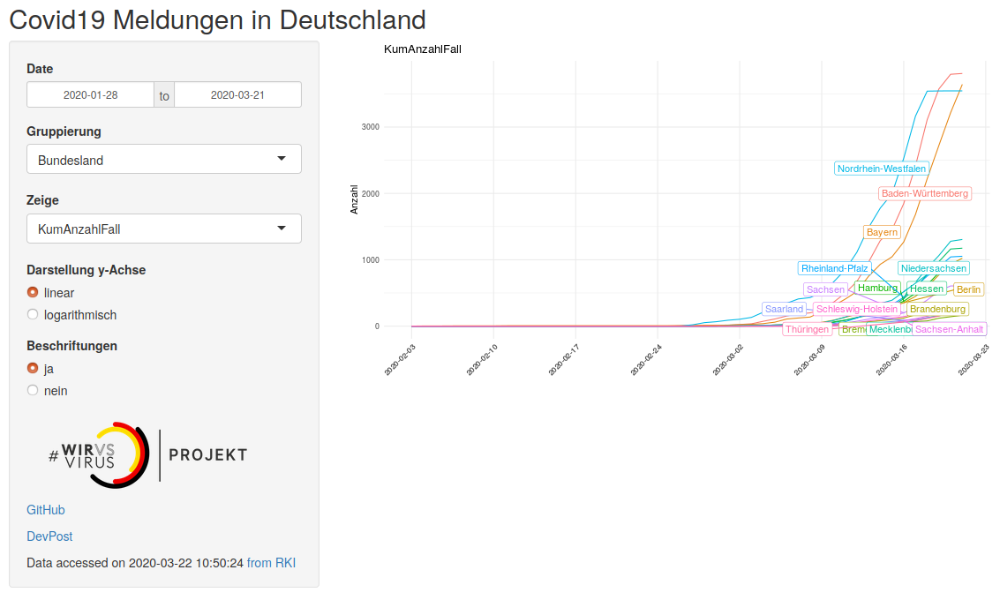

# covid19germany

An R package to load, visualise and analyse daily updated data on the COVID-19 outbreak in Germany. This package exists to simplify data analysis and was developed in the context of the [#WirvsVirus hackathon](https://www.bundesregierung.de/breg-de/themen/coronavirus/wir-vs-virus-1731968).

<p align="center">
  
</p>

- [**Install**](#Install)
- [**Functions and data**](#functions-and-data)
    - [RKI timeseries](#rki-timeseries)
    - [Population numbers](#population-numbers)
    - [Hospital beds](#hospital-beds) 
- [**Example code snippets**](#example-code-snippets)
    - [Get and join data](#get-and-join-data)
    - [Example plots](#example-plots)
- [**Simple Model**](#simple-model)
- [**Web App**](#web-app)


## Install 

Install the development version from github with

```
if(!require('devtools')) install.packages('devtools')
devtools::install_github("nevrome/covid19germany")
```
## Functions and data

### RKI timeseries

```
covid19germany::get_RKI_timeseries()
```

[Daily updated RKI data about COVID-19 cases and deaths for germany (timeseries)](https://npgeo-corona-npgeo-de.hub.arcgis.com/datasets/dd4580c810204019a7b8eb3e0b329dd6_0). Provided by the Bundesamt für Kartographie und Geodäsie as well as the Robert Koch Institut. 

Data format: tibble/data.frame with one row per spatial unit ("Landkreis"), date and age group, with daily notifications of cases ("AnzahlFall") and deaths ("AnzahlTodesfall").

|IdBundesland|Bundesland|Landkreis|Altersgruppe|Geschlecht|AnzahlFall|AnzahlTodesfall|ObjectId|Meldedatum|IdLandkreis|
|--|--------------|------------|-------|-|-|-|------|----------|-----|
|15|Sachsen-Anhalt|SK Magdeburg|A35-A59|M|2|0|154936|2020-03-18|15003|
|15|Sachsen-Anhalt|SK Magdeburg|A35-A59|W|1|0|154937|2020-03-12|15003|
|15|Sachsen-Anhalt|SK Magdeburg|A35-A59|W|1|0|154938|2020-03-17|15003|

You can convert this RKI data to daily timeseries for federal states (Bundesland), administrative districts (Landkreis), gender (Geschlecht) and/or age (Altersgruppe). It's possible to group by muliple of these at once.

```
covid19germany::group_RKI_timeseries(data, "Bundesland" | "Landkreis" | "Geschlecht" | "Altersgruppe")
```

Data format: tibble/data.frame with a time series of cases, deaths, cumulative cases and cumulative deaths. One row per day and grouping unit. Days are continuous, without gaps. All time series start at 2020-01-28, and go up to the current date (last update by RKI). `covid19germany::group_RKI_timeseries(data, "Bundesland")`:

|Bundesland|Meldedatum|AnzahlFall|AnzahlTodesfall|KumAnzahlFall|KumAnzahlTodesfall|IdBundesland|
|------|----------|-|-|-|-|-|
|Bayern|2020-01-28|2|0|2|-|9|
|Bayern|2020-01-29|2|0|4|0|9|
|Bayern|2020-01-30|0|0|4|0|9|

### Population numbers

```
covid19germany::ew_laender
covid19germany::ew_kreise
```

[Population numbers for the german Länder](https://www.statistikportal.de/de/bevoelkerung/flaeche-und-bevoelkerung) and [Kreise](https://www.destatis.de/DE/Themen/Laender-Regionen/Regionales/Gemeindeverzeichnis/Administrativ/04-kreise.html) on 2018-12-31. Provided by the Statistisches Bundesamt.

Data format: tibble/data.frame with information about population and area size of Länder and Kreise. One row per Land/Landkreis.

|Bundesland         | FlaecheKm2| EwGesamt| EwMaennlich| EwWeiblich| EwProKm2|
|:------------------|----------:|--------:|-----------:|----------:|--------:|
|Schleswig-Holstein |   15804.30|  2896712|     1419457|    1477255|      183|
|Hamburg            |     755.09|  1841179|      902048|     939131|     2438|
|Niedersachsen      |   47709.51|  7982448|     3943243|    4039205|      167|

| IdLandkreis|NameLandkreis          |NUTS3 | FlaecheKm2| EwGesamt| EwMaennlich| EwWeiblich| EwProKm2|
|-----------:|:----------------------|:-----|----------:|--------:|-----------:|----------:|--------:|
|        1001|Flensburg, Stadt       |DEF01 |      56.73|    89504|       44599|      44905|     1578|
|        1002|Kiel, Landeshauptstadt |DEF02 |     118.65|   247548|      120566|     126982|     2086|
|        1003|Lübeck, Hansestadt     |DEF03 |     214.19|   217198|      104371|     112827|     1014|

### Hospital beds

```
covid19germany::hospital_beds
```

[Hospital beds and ICUs in Germany](http://www.gbe-bund.de/gbe10/f?f=328::Intensivstation) in 2017 with a last update from 2018-11-13. Provided by the Statistisches Bundesamt as well as the Robert Koch Institut.

Data format: tibble/data.frame with information about number, facilities and occupancy rate of hospitals and hospital beds in the german Länder. One row per Land.

|Bundesland             |AnzahlKrankenhaeuser | AnzahlKrankenhaeusermitIntensiv| AnzahlBettenIntensiv| AnzahlBelegungstageIntensiv| AnzahlBehandlungsfaelleIntensiv| AnzahlBehandlungsfaelleIntensivmitBeatmung|
|:----------------------|:--------------------|-------------------------------:|--------------------:|---------------------------:|-------------------------------:|------------------------------------------:|
|Baden-Württemberg      |265                  |                             123|                 3262|                      900678|                          259066|                                      47528|
|Bayern                 |354                  |                             178|                 3790|                     1085912|                          300728|                                      62044|
|Berlin                 |83                   |                              35|                 1450|                      439183|                           94480|                                   22887|

## Example code snippets

### Get and join data

```r
# Get RKI data and transform to daily time series, e.g. per "Bundesland"
data <- covid19germany::get_RKI_timeseries()
time_series <- covid19germany::group_RKI_timeseries(data, "Bundesland")

# Extract one "Bundesland" and plot cumulative cases
bayern <- time_series[time_series$Bundesland == "Bayern",]
plot(bayern$Meldedatum, bayern$KumAnzahlFall, type="l")

# Join population to RKI table
# Population data for "Landkreise" is available as "ew_kreise". Use "IdLandkreis" as join column.
time_series <- time_series %>%
  left_join(ew_laender, by="Bundesland")

# Calculate cases per 100k inhabitants
time_series$KumFaelle100kEW <- 100000 * time_series$KumAnzahlFall / time_series$EwGesamt
  
```

### Example plots

```r
library(ggplot2)
library(magrittr)

dat <- get_RKI_timeseries(cache=F)

group_RKI_timeseries(dat, Bundesland) %>%
  dplyr::filter(Meldedatum > "2020-02-25") %>%
  tidyr::drop_na(Bundesland) %>%
  ggplot() +
  geom_bar(mapping = aes(x = Meldedatum,
                         y = AnzahlFall,
                         fill = Bundesland),
           stat = 'identity') +
  theme_minimal() +
  ggtitle("Gemeldete Infektionen (täglich)") +
  theme(axis.title.x=element_blank(),
        axis.title.y=element_blank())
```

results in this plot:


```r
library(ggplot2)
library(magrittr)

dat <- get_RKI_timeseries(cache=F)

group_RKI_timeseries(dat, Bundesland) %>%
  dplyr::filter(Meldedatum > "2020-02-25") %>%
  tidyr::drop_na(Bundesland) %>%
  dplyr::group_by(Bundesland) %>%
  dplyr::mutate(kum_fall = cumsum(AnzahlFall)) %>%
  dplyr::ungroup() %>%
  ggplot() +
  geom_area(mapping = aes(x = Meldedatum,
                          y = kum_fall,
                          fill = Bundesland),
            stat = 'identity',
            na.rm = T) +
  theme_minimal() +
  ggtitle("Gemeldete Infektionen (kumulativ)") +
  theme(axis.title.x=element_blank(),
        axis.title.y=element_blank())
```

results in this plot:



Since we have the inhabitant numbers right in the package, co-analysing them toegther with the epidemiologocal data is straight forward:

```r
data("ew_laender")
group_RKI_timeseries(dat, Bundesland) %>%
  dplyr::left_join(ew_laender, by="Bundesland") %>%
  dplyr::filter(Meldedatum > "2020-02-25") %>%
  tidyr::drop_na(Bundesland) %>%
  dplyr::group_by(Bundesland) %>%
  dplyr::mutate(kum_fall_per100k_ew = cumsum(AnzahlFall) / EwGesamt) %>%
  dplyr::ungroup() %>%
  ggplot() +
  geom_line(mapping = aes(x = Meldedatum,
                          y = kum_fall_per100k_ew,
                          col = Bundesland)) +
  theme_minimal() +
  ggtitle("Gemeldete Infektionen pro 100K Einwohner (kumulativ)") +
  theme(axis.title.x=element_blank(),
        axis.title.y=element_blank())
```

resulting in this plot:



## Simple Model
A simple modelling approach to predict the number of future cases regresses historical counts on time. These predictions assume no further interventions like social distancing! Since the spread-dynamics are exponential, we choose a simple log-linear regression approach on new cases per day (i.e. not cumulative in this analysis): 
```r
## globals:
MIN.CASES=5
N.DAYS.FUTURE=7

## read data:
df = get_RKI_timeseries()

## aggregate case-counts by regions:
ag=aggregate(df$AnzahlFall,by=list(Bundesland=df$Bundesland,Meldedatum=df$Meldedatum),sum)

## split data by regions:
ag.split=split(ag,ag$Bundesland)

## plot
par(mfrow=c(4,4))
par(cex=1.2)
for (this.ag in ag.split){
  keep=(this.ag$x>=MIN.CASES)
  this.ag=this.ag[keep,]
  this.region=unique(this.ag$Bundesland)
  
  ## create model
  this.ag = this.ag[order(this.ag$Meldedatum),]
  this.ag[,"x.log"]=log(this.ag[,"x"])
  mdl=lm("x.log ~ Meldedatum",data=this.ag)

  ## append N.DAYS.FUTURE to data
  n=(nrow(this.ag)+1)
  last.date=as.Date(max(this.ag$Meldedatum))
  this.ag[n:(n+N.DAYS.FUTURE-1),]=NA
  this.ag[n:(n+N.DAYS.FUTURE-1),"Meldedatum"]=seq(last.date+1,by=1,length.out=N.DAYS.FUTURE)

  ## predict on all dates (including future dates)
  this.ag[,"x.pred"]=exp(predict(mdl,newdata=this.ag))

  ## plot data and prediction
  ymax=max(this.ag[,c("x.pred","x")],na.rm=TRUE)
  plot(this.ag[,"Meldedatum"],this.ag[,"x"],type="b",col="black",pch=20,main=this.region,xlab="date",ylab="cases",ylim=c(0,ymax))
  points(this.ag[,"Meldedatum"],this.ag[,"x.pred"],type="b",col="red")
}
```



## Web App

This package contains a web application for interactive visualization of up--to--date data based on the [R Shiny](https://shiny.rstudio.com/) frame work.
Access the web--app right [here](https://joboog.shinyapps.io/Covid19germany/).
Have fun!




## Known issues

* Missing population data for administrative units of Berlin in dataset ew_laender (Source: https://www.destatis.de)

