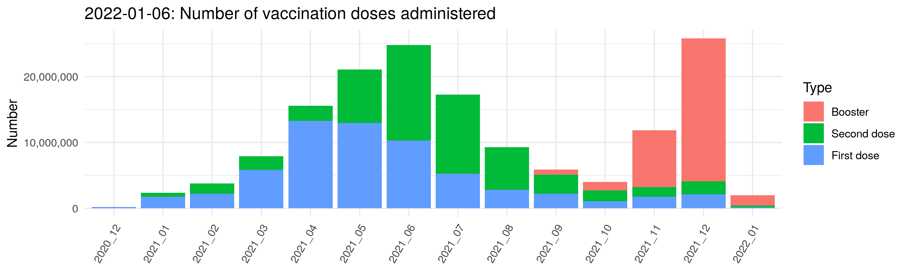

<!-- Rmd -> md -->

# covid19germany

An R package to load, visualise and analyse daily updated data on the
COVID-19 outbreak in Germany. This package exists to simplify data
analysis and was developed in the context of the [#WirvsVirus
hackathon](https://www.bundesregierung.de/breg-de/themen/coronavirus/wir-vs-virus-1731968).

-   [**Install**](#Install)
-   [**Functions and data**](#functions-and-data)
    -   [RKI vaccination progress](#rki-vaccination-progress)
    -   [RKI timeseries](#rki-timeseries)
    -   [RKI spatial](#rki-spatial)
    -   [Population numbers](#population-numbers)
    -   [Hospital beds](#hospital-beds)

## Install

Install the development version from github with

    if(!require('remotes')) install.packages('remotes')
    remotes::install_github("nevrome/covid19germany")

## Functions and data

### RKI vaccination progress

[Daily updated RKI data about COVID-19 vaccinations in
germany](https://www.rki.de/DE/Content/InfAZ/N/Neuartiges_Coronavirus/Daten/Impfquoten-Tab.html).
Provided by the Robert Koch Institut.

    rki_vaccinations_timeseries <- covid19germany::get_RKI_vaccination_timeseries()

### RKI timeseries

    rki <- covid19germany::get_RKI_timeseries()

[Daily updated RKI data about COVID-19 cases and deaths for germany
(timeseries)](https://npgeo-corona-npgeo-de.hub.arcgis.com/datasets/dd4580c810204019a7b8eb3e0b329dd6_0).
Provided by the Bundesamt für Kartographie und Geodäsie as well as the
Robert Koch Institut.

You can convert this RKI data to daily timeseries for federal states
(Bundesland), administrative districts (Landkreis), gender (Gender)
and/or age (Age).

    covid19germany::group_RKI_timeseries(rki, Bundesland)
    covid19germany::group_RKI_timeseries(rki, Landkreis)
    covid19germany::group_RKI_timeseries(rki, Gender)
    covid19germany::group_RKI_timeseries(rki, Age)

It’s possible to group by multiple of these at once, e.g.

    covid19germany::group_RKI_timeseries(rki, Bundesland, Age)

### RKI spatial

    covid19germany::get_RKI_spatial("Bundesland")
    covid19germany::get_RKI_spatial("Landkreis")

[Daily updated RKI data about COVID-19 cases and deaths for germany
(spatial)](https://npgeo-corona-npgeo-de.hub.arcgis.com/search?groupIds=b28109b18022405bb965c602b13e1bbc).
Provided by the Bundesamt für Kartographie und Geodäsie as well as the
Robert Koch Institut.

### Population numbers

    covid19germany::ew_laender
    covid19germany::ew_kreise
    covid19germany::ew_alter

[Population numbers for the german
Länder](https://www.statistikportal.de/de/bevoelkerung/flaeche-und-bevoelkerung)
and
[Kreise](https://www.destatis.de/DE/Themen/Laender-Regionen/Regionales/Gemeindeverzeichnis/Administrativ/04-kreise.html)
on 2018-12-31. Provided by the Statistisches Bundesamt. (Population data
for administrative units of Berlin in dataset ew_laender is missing.)

### Hospital beds

    covid19germany::hospital_beds

[Hospital beds and ICUs in
Germany](http://www.gbe-bund.de/gbe10/f?f=328::Intensivstation) in 2017
with a last update from 2018-11-13. Provided by the Statistisches
Bundesamt as well as the Robert Koch Institut.
